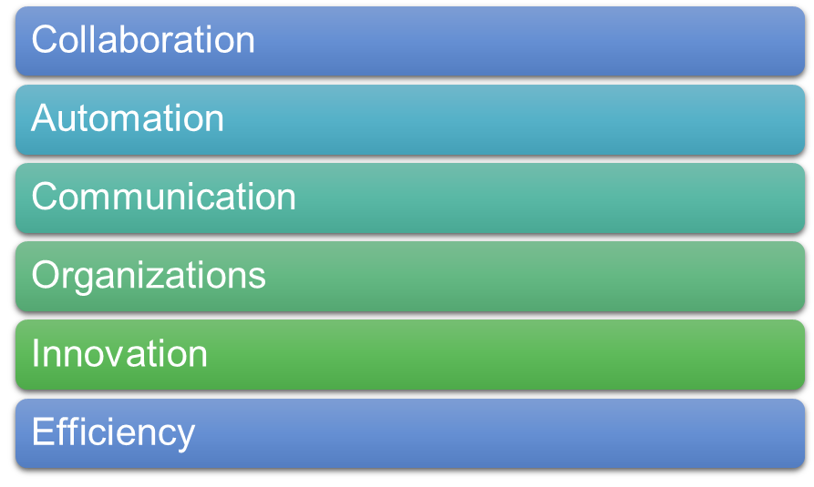
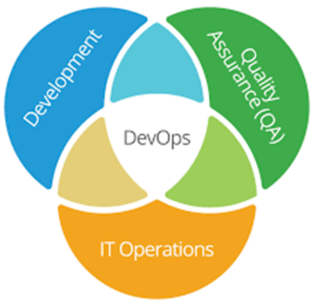
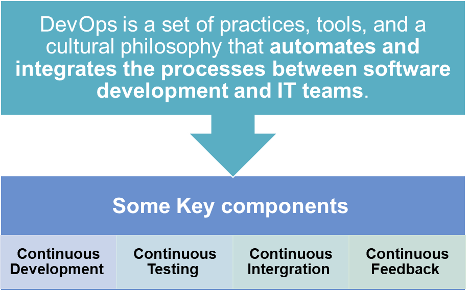
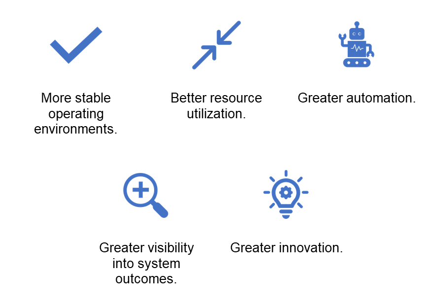

# What is DevOps?

DevOps uses the agile way of working to combine software development and IT operations.
- DevOps seeks to automate and improve the process of software delivery, from development to deployment
- This includes automating the build, test, and release processes, as well as providing tools and processes to ensure that software is released quickly and reliably. 
- DevOps is used to help organizations better manage their IT infrastructure, enabling them to respond quickly to changes in the environment.
- By improving communication and collaboration, DevOps can help organizations reduce costs, improve customer satisfaction, and increase the speed of innovation.

## What does the DevOps role entail?

## What are the benefits of DevOps?

## What tools are used in DevOps?

DevOps testing tools are designed to help software development and delivery teams test their code more effectively. By automating certain tasks and providing an easy way to manage testing data, these tools can help streamline the process and make it more efficient.

Some examples of DevOps tools include;

-Git for version control

-Jenkins for continuous integration and automation

-Ansible for configuration management

-Docker for containerization

-Kubernetes for container orchestration

-Nagios for monitoring and alerting

-Grafana for data visualization and metrics tracking

-Selenium for automated testing

-JIRA for project management and issue tracking.

## How does DevOps benefit a business?
